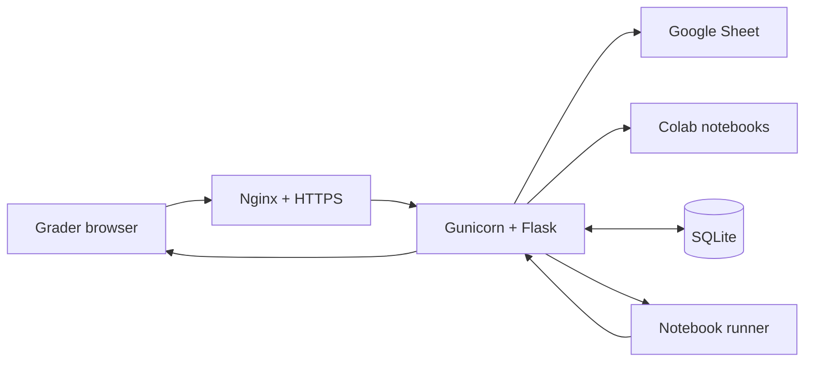

# Submission Desk

A Flask app for reviewing and running student Google Colab/Jupyter submissions from a master Google Sheet. It supports class rosters, assignment queues, per-cell output, and sequential **Run all** execution.

Hosted at [iwucsgrader.site](https://iwucsgrader.site).

## Run locally

```bash
git clone git@github.com:yohanc3/sheet-explorer-plus.git
cd sheet-explorer-plus
python3 -m venv .venv
source .venv/bin/activate
python3 -m pip install -r requirements.txt
python3 app.py
```

Open <http://127.0.0.1:8000>. On later runs:

```bash
git pull origin main
source .venv/bin/activate
python3 app.py
```

## Use

1. Create a class and add students in **Manage classes**.
2. Let the app fetch the latest public sheet, or import an `.xlsx` file.
3. Choose an assignment, class, and student.
4. Review cells individually or select **Run all**.

Data is stored in `data/sheet_explorer.db`. Override it with `SHEET_EXPLORER_DB`, or change the sheet with `MASTER_SHEET_EXPORT_URL`.

> Student code executes on the host machine. Only run trusted submissions or use an isolated environment.

## Architecture

### 1. How it works

The browser calls the Flask API. Flask downloads and parses the master sheet, stores classes in SQLite, retrieves shared notebooks, and sends code to a separate notebook process. In production, Nginx provides HTTPS and authentication while Gunicorn runs Flask.

### 2. Diagram


